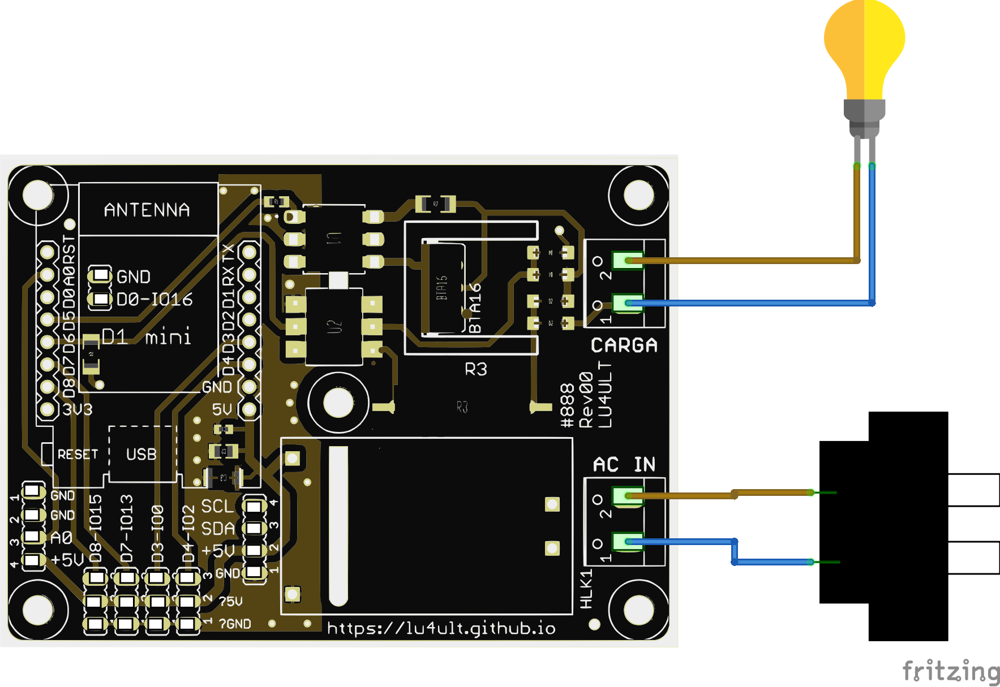
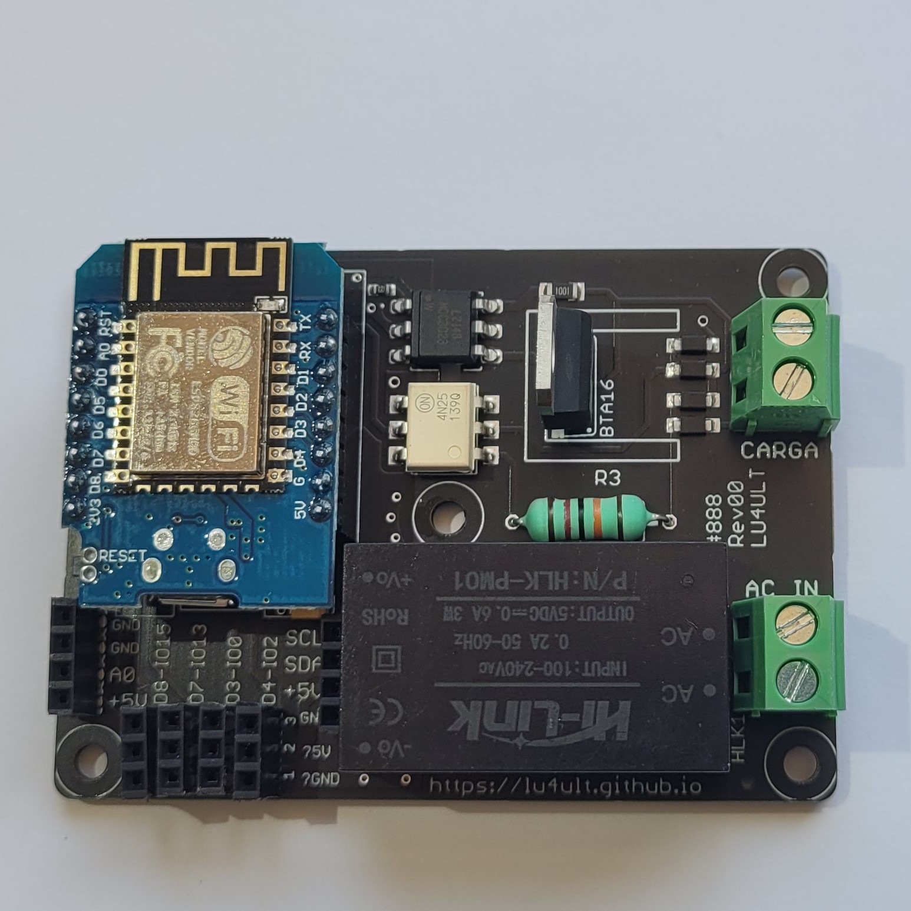

# dimmer-modulo-desarrollo

Módulo dimmer con cruce con cero, con Wemos y Fuente integradas.


<h2>Conexión Básica (pictórico)</h2>
Archivo Fritzing disponible




Fotos:





<h3>Bibliotecas (librerías)</h3>
Todos los ejemplos utilizan una función simple para hacer el disparo del triac dentro de una interrupción disparada por el detector de cruce por cero:

```
ICACHE_RAM_ATTR
void zeroCrosssInt()  {
  if(dimming<10 or dimming>120) {
    if(dimming<10)
      digitalWrite(14, HIGH);
    if(dimming>120)
      digitalWrite(14, LOW);
  }
  else {
    delayMicroseconds(75*dimming);
    digitalWrite(14, HIGH);
    delayMicroseconds(10);
    digitalWrite(14, LOW);
  }
}
```

Si biene existen librerías que se pueden utilizar esta es la forma que mejores resultados nos ha dado (más estable y sin parpadeos)
Las librerías son:

<a href="https://github.com/RobotDynOfficial/RBDDimmer" target="_blank">https://github.com/RobotDynOfficial/RBDDimmer</a>

Esta biblioteca funciona para Core 2.4, sin embargo no tiene actividad en los últimos años y para las versiones más recientes del Core de ESP (actualmente 3.0.2) requiere agregar:
ICACHE_RAM_ATTR

Ya que al correr cualquier ejemplo se activa el watchdog con la descripción "ISR not in IRAM"


<a href="https://github.com/fabianoriccardi/dimmable-light" target="_blank">https://github.com/fabianoriccardi/dimmable-light</a>

Esta biblioteca funciona bien y la mantienen actualizada pero en algunos puntos de brillo presenta "flicks" o "parpadeos".

